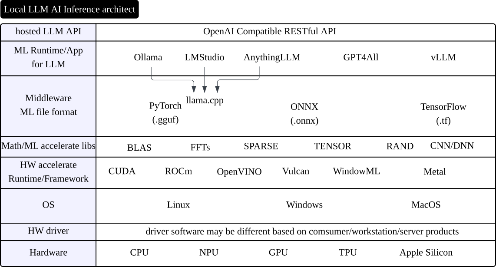
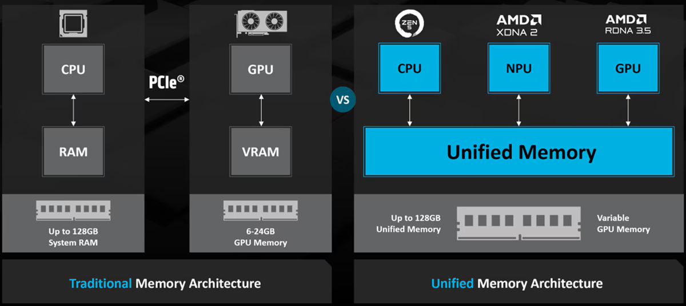
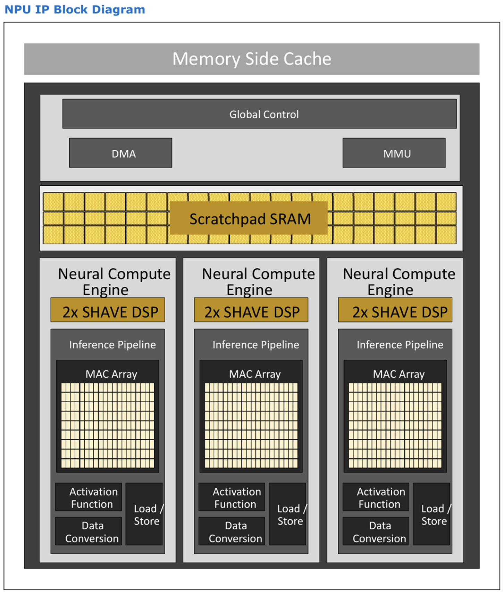
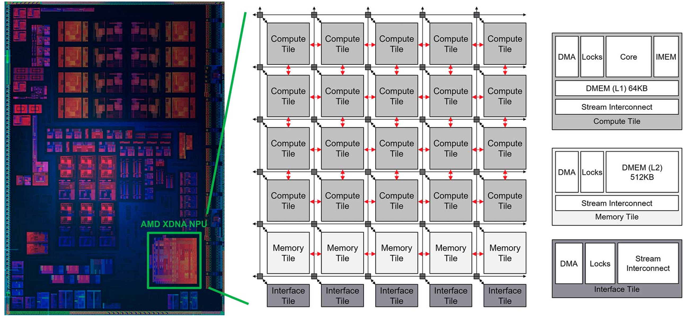
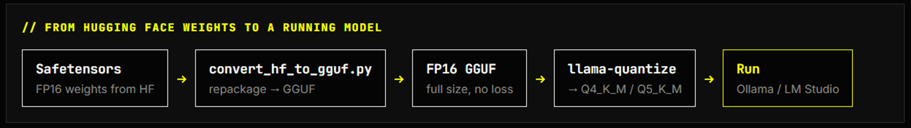
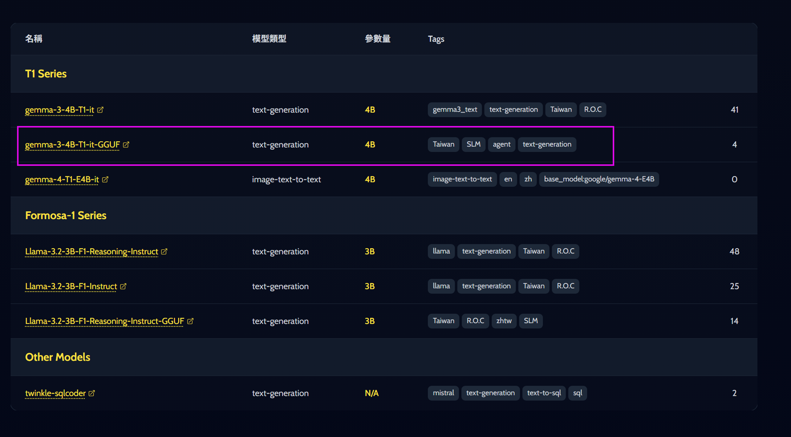
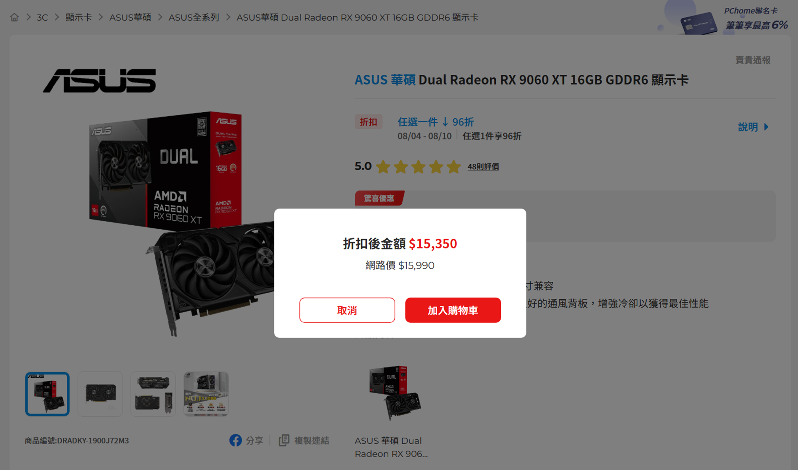

# Agenda

:::: {.columns}
::: {.column width="80%"}

* 地端推論運算架構解析
* 地端設備運行 Twinkle AI 模型挑戰
    * 地端硬體規格 
    * Ollama
    * LM Studio
    * Lemonade
    * vLLM
    * oBeaver
* 結論

:::
::: {.column width="20%"}



::::{.text-center .smaller}
**Slide URL**
::::

:::
::::

# 地端推論運算架構解析

##

{.r-stretch}

地端主流以 [OpenAI compatible RESTful API](https://bentoml.com/llm/llm-inference-basics/openai-compatible-api){target="_blank"} 做為與其他框架的整合方法。

## GPU vs NPU

* GPU (Graphics Processing Unit)
   * 高效能
   * 除了整合/UMA架構之外，其他為獨立高速高成本 VRAM
   * 大部分的 LLM 推論框架都支援 GPU (通常模型不需轉檔)
   * 算力強VRAM大的可以對模型做再次加工(如量化、蒸餾、LoRA)
* NPU (Neural Processing Unit)
   * 省電(適合低功耗設備/長時間運行的場合)
   * 針對 AI 推論硬體加速
   * 記憶體與CPU共用/整合在 SoC 晶片內
   * 目前仍以 ONNX Runtime 為主流，對於 LLM 推論框架的支援度不如 GPU (需從原始 Safetensors 或 GGUF 格式模型轉檔)

##

{.r-stretch}

## NPU 各自的硬體設計架構

:::: {.columns}
::: {.column width="50%"}

:::
::: {.column width="50%"}

:::
::::

## 

## GGUF file format

目前LLM模型的主流格式為 GGUF (GGML Unified Format):

[https://github.com/ggml-org/ggml/blob/master/docs/gguf.md](https://github.com/ggml-org/ggml/blob/master/docs/gguf.md){target="_blank"}
  
[GGML 團隊](https://github.com/ggml-org/ggml){target="_blank"}所提出的統一格式，目的是為了讓不同的 LLM 推論框架可以共用同一個模型檔案。

llama.cpp 開源專案有提供轉換的 Python script，將原始 Hugging Face 的 Safetensors 模型轉換成 GGUF 格式。 

## GGUF 模型檔即時轉換

Intel 早期的 OpenVINO LLM 推論框架，對於 GGUF 模型檔的支援度不佳，必須先將 GGUF 模型檔轉換成 ONNX 格式才能使用。

今年開始的版本提供即時轉換功能，因此可以直接使用 GGUF 模型檔。

<https://docs.openvino.ai/2026/openvino-workflow/model-preparation.html>

後續的改良會使用 llama.cpp 開源專案的成果來做 GGUF 檔案轉換：<https://github.com/openvinotoolkit/openvino/pull/36579>

# 地端設備運行 Twinkle AI 模型 挑戰

## 目標模型

為了力求能以最經濟實惠&簡單的方式跑起來，使用 Twinkle AI T1 Series 模型，直接取用 GGUF 格式模型檔。

[https://twinkleai.tw/models](https://twinkleai.tw/models){target="_blank"}

{.r-stretch}

## 使用的地端算力設備

目前對於軟體支援度/VRAM大小比較起來  
c/p值還行的 _AMD Radeon RX 9060 XT_(16GB VRAM) 顯示卡

{.r-stretch}

# 其他參考資料 {.smallest}

::: {style="overflow-y: scroll; height: 860px;"}

**GGUF file format**

* [GGUF Official format explain](https://github.com/ggml-org/ggml/blob/master/docs/gguf.md)
* [Hugging Face](https://huggingface.co/docs/hub/gguf)
* [Running GGUF and Safetensors Models: The Complete Engineer’s Guide to Modern AI Model Formats](https://medium.com/@imrohitkushwaha2001/running-gguf-and-safetensors-models-the-complete-engineers-guide-to-modern-ai-model-formats-6e7745e0b3b7)

**Books**

* [Inference Engineering](https://www.baseten.co/inference-engineering/)

**Video**

* [LLM Inference Deep Dive: TensortRT-LLM, KV Cache, Prefill vs Decode, TTFT, TPOT](https://youtu.be/cQM2RfT4VpY)
* [5 Essential LLM Optimization](https://www.youtube.com/playlist?list=PLuOtX1AplgcvdjCK-tk4TPiYOGsKkil6J)
* [Prototype and Deploy LLM Applications on Intel® NPUs](https://www.intel.com/content/www/us/en/developer/videos/prototype-deploy-llm-applications-on-intel-npus.html)

**Papers/Web articles**

* [LLM Inference at the Edge: Mobile, NPU, and GPU Performance Efficiency Trade-offs Under Sustained Load](https://arxiv.org/abs/2603.23640v1)
* [The Processor War - CPU vs GPU vs TPU](https://www.linkedin.com/pulse/processor-war-cpu-vs-gpu-tpu-jeugene-john-r7toc/)
* [Intel® Core™ Ultra Series 3 processor Datasheet](https://www.intel.com/content/www/us/en/content-details/872188/intel-core-ultra-series-3-processor-datasheet-volume-1-of-2.html)
* [NPU Comparison 2026](https://localaimaster.com/blog/npu-comparison-2026)
* [除英伟达外硬件平台的AI架构生态和大模型部署情况调研](https://zhuanlan.zhihu.com/p/1939465070796071861)

:::